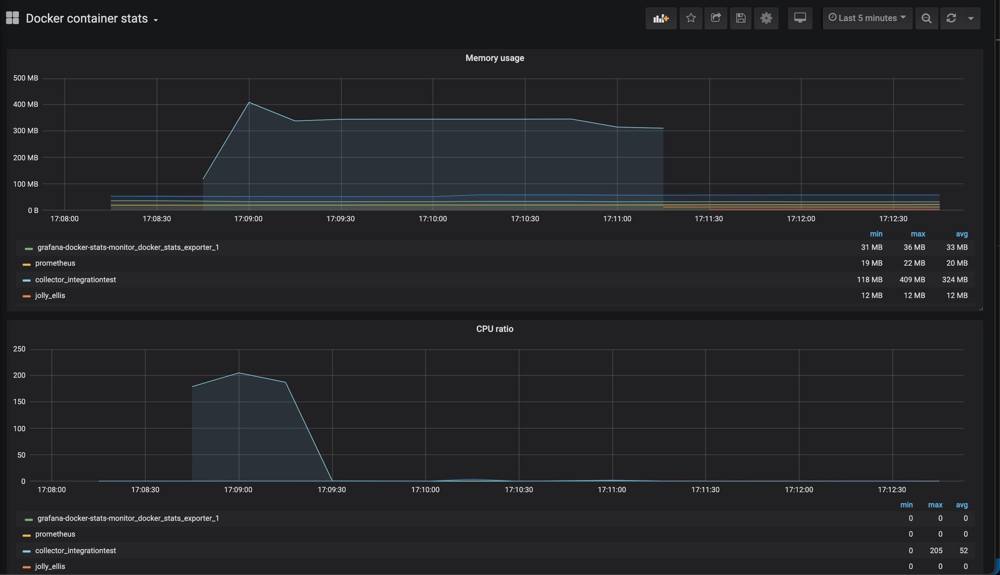
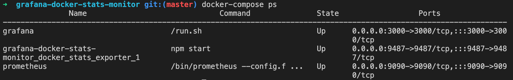
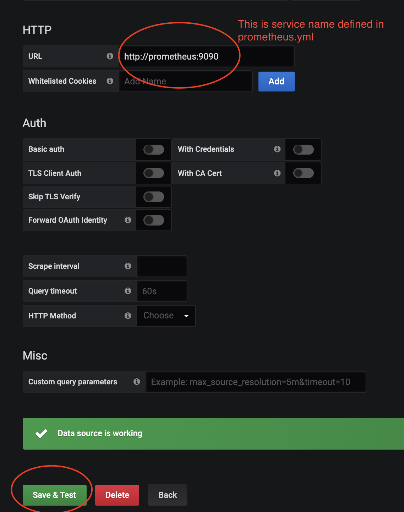

## Goal
* monitor local docker containers stats by a nice GUI



## Components
1. docker container: the monitor target
2. stats exporter: [DockerStatsExporter](https://github.com/wywywywy/docker_stats_exporter)
3. stats collector: [Prometheus](https://prometheus.io/)
4. GUI: [Grafana](https://grafana.com/)

## Installation - super easy
* Install the monitor with one simple command
    * `docker-compose up -d`



* Now you can access these servers
    * Get in Grafana: http://localhost:3000
    * Get in Prometheus: http://localhost:9090
    * Get in DockerStatsExporter: http://localhost:9487

## Setup Grafana dashboard to monitor the containers
* select data soure - prometheus
    * "Add Data Source" -> select "Prometheus" -> setup prometheus `http://prometheus:9090`




* Import docker stats dashboard template
    * Click "Import" and upload the following JSON file 
        * docker-container-stats-dashboard.json 


### How it works
* All secrects is in `prometheus.yml` and `docker-compose.yml`
  
### How does the exporter get the docker stats from docker?
- get specific container's stats once
```bash
$curl --unix-socket /var/run/docker.sock http://localhost/containers/<container-name>/stats\?stream\=false | jq
```

## References
* [Docker container stats dashboard](https://grafana.com/grafana/dashboards/13331)
* [docker socket](https://lobster1234.github.io/2019/04/05/docker-socket-file-for-ipc/)
* [docker stats exporter](https://github.com/wywywywy/docker_stats_exporter)

## Miscellaneous
+ cadvisor - https://github.com/google/cadvisor
   - provides container users an understanding of the resource usage and performance characteristics of their running containers.
